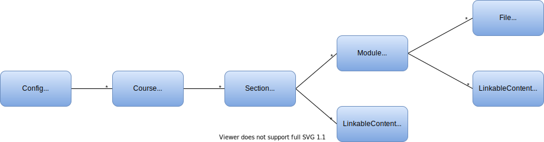

# Domain Documentation

The domain of this application closely follows Moodle's domain with a few atribute omissions that are not necessary in
this context.

## Domain Hierarchy

### Config

The Config class represents all the necessary information about a Moodle in order to comunicate with it. Parameters like
username, password, the host, etc. are all stored here. Since the application supports multiple Moodles there can be
more than one Config.

### Course

The Course class stores the necessary information about a course and it's sections.

For more information about a Course, [click here to see the Moodle docs.](https://docs.moodle.org/39/en/Courses)

### Section

The Section class stores the necessary information about a section and it's modules.

For more information about a Section, [click here to see the Moodle docs.](https://docs.moodle.org/19/en/Course_sections)

### Module and LinkableContent

The Section class can store a Module or a LinkableContent.

#### When to use each?

You should use a Module if it's `modname` has a domain represention or if it has a `contents` property. If none of those
conditions are true, use a LinkableContent with the module's url.

You can obtain the `modname` and `contents` property through the Moodle Web Services function:
`core_course_get_contents`.

#### Module

The Module class stores the necessary information about a module and it's contents.

For more information about a Module, [click here to see the Moodle docs.](https://docs.moodle.org/dev/Course_module)

#### LinkableContent

LinkableContent, like Config, isn't present in a Moodle's domain. In this program it is used to store information about
contents/resources that haven't (or won't) be implemented in the application.

This information includes:

- Where the content is (either a section or a module)
- If it has a id of it's own (usually contents don't have an id, but modules do)
- Name
- URL

### File and LinkableContent

The same logic applies here. If the content is a file or a known domain class, use that class. Otherwise just store it's
URL in a LinkableContent.

#### File

The File class stores the necessary information about a file.

For more information about a File, [click here to see the Moodle docs.](https://docs.moodle.org/39/en/File_resource)
